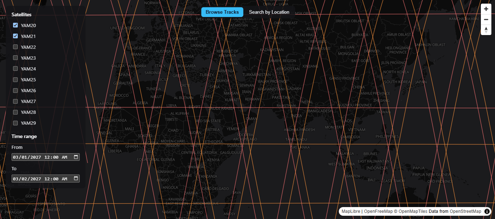
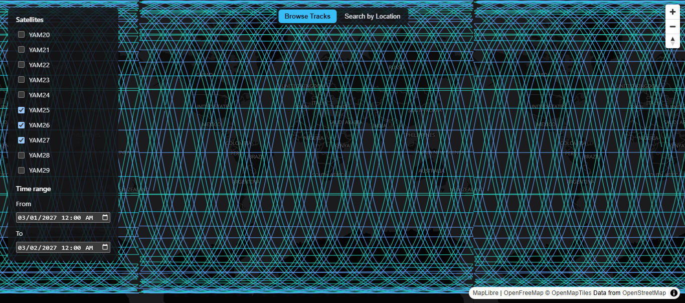
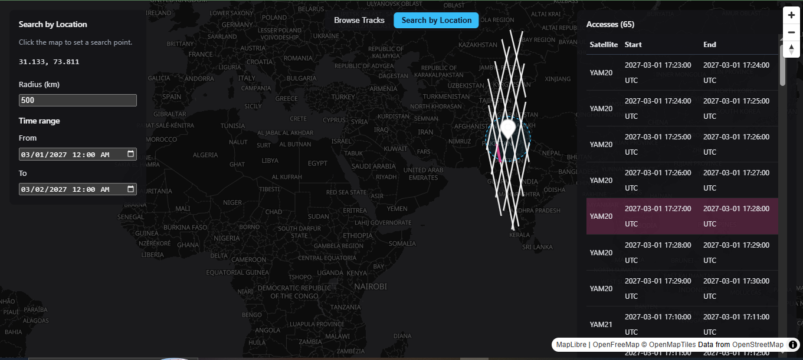

# Ephemeris

**A full-stack spatiotemporal satellite-pass visualization application built with React, TypeScript, MapLibre GL JS, Express, and DuckDB Spatial.**

Ephemeris is a map-centric application for exploring satellite passes across time and geographic locations.

It provides two core workflows:

- **Browse Tracks:** filter satellite passes by satellite and time range, then visualize the resulting trajectories on an interactive map.
- **Search by Location:** select a location, define a search radius and date range, and find satellite passes matching the geographic and temporal criteria.

The application was built as a full-stack engineering project with a focus on geospatial computation, frontend architecture, API design, testing, containerization, and CI validation.

---

## Demo

### Browse Tracks

Filter satellite passes by satellite and time range, then visualize their trajectories on an interactive MapLibre map.



Explore satellite trajectories across the map and inspect the resulting pass data.



### Search by Location

Select a point on the map, define a search radius and date range, and find matching satellite passes.

Results are displayed both geographically on the map and in a synchronized Accesses table.



---

## Architecture

Ephemeris uses a separated frontend and backend architecture.

```text
┌─────────────────────────────────────────────┐
│                React Frontend               │
│                                             │
│ React 19 · TypeScript · Vite                │
│ MapLibre GL JS · Zustand · React Query      │
└──────────────────────┬──────────────────────┘
                       │
                       │ REST API
                       ▼
┌─────────────────────────────────────────────┐
│                 Express API                 │
│                                             │
│ Node.js · TypeScript                        │
│ Controllers · Routes                        │
└──────────────────────┬──────────────────────┘
                       │
                       ▼
┌─────────────────────────────────────────────┐
│              DuckDB + Spatial               │
│                                             │
│ Satellite track data                        │
│ Geometry construction                       │
│ Geographic proximity queries                │
│ Temporal filtering                           │
└─────────────────────────────────────────────┘
```

The frontend handles interaction, visualization, client-side state, and server-state management.

The backend exposes the satellite-pass API and performs spatial and temporal queries against DuckDB.

---

## Core Features

### Browse Tracks

Browse satellite passes using:

- Satellite selection
- Time-range filtering
- Interactive map visualization
- Satellite trajectory rendering

The resulting passes are rendered as tracks on the MapLibre map.

### Search by Location

Search for satellite passes using:

- A point selected directly on the map
- Search radius in kilometres
- Date range
- Spatial proximity matching
- Temporal filtering

Matching passes are displayed on the map and in the Accesses table.

Selecting a table row highlights the corresponding track on the map.

---

## Technical Implementation

### Frontend

The frontend is built with React 19 and TypeScript.

**MapLibre GL JS** provides the interactive map and satellite trajectory visualization.

**Zustand** manages client-side filter and search state.

**TanStack React Query** manages server-state fetching and caching.

Vite provides the development server and frontend build pipeline.

### Backend

The API is implemented using Node.js, Express, and TypeScript.

The backend provides endpoints for satellite-pass browsing and geographic searches, with filtering performed using satellite, geographic, and temporal criteria.

### Spatial Data

DuckDB with its Spatial extension is used for data processing and geographic queries.

Satellite track coordinates are converted into spatial geometry, allowing geographic proximity and geometry operations to be performed directly within the database layer.

---

## Tech Stack

### Frontend

- React 19
- TypeScript
- Vite
- MapLibre GL JS
- Zustand
- TanStack React Query
- CSS

### Backend

- Node.js
- Express
- TypeScript
- DuckDB
- DuckDB Spatial extension

### Geospatial

- Spatial geometry
- Geographic proximity queries
- Temporal filtering
- Satellite track visualization
- MapLibre GL JS
- GeoJSON

### Testing & Tooling

- Vitest
- ESLint
- Stylelint
- Prettier
- Docker
- Docker Compose
- GitHub Actions

---

## Data Flow

A typical location search follows this flow:

```text
User selects location
        │
        ▼
User defines radius + date range
        │
        ▼
React state
        │
        ▼
TanStack React Query
        │
        ▼
Express API
        │
        ▼
DuckDB Spatial query
        │
        ├─────────────────┐
        ▼                 ▼
Matching tracks      Accesses data
        │                 │
        └────────┬────────┘
                 ▼
          React application
                 │
          ┌──────┴──────┐
          ▼             ▼
       MapLibre       Table
```

This keeps spatial querying in the data layer while allowing the frontend to focus on visualization and interaction.

---

## Testing & Quality

The backend includes fixture-based unit tests covering:

- Time-overlap filtering
- Satellite filtering
- Spatial search behaviour
- Injection-safety cases

Run the backend tests with:

```bash
npm run test --workspace=backend
```

Run backend linting with:

```bash
npm run lint --workspace=backend
```

Run frontend linting with:

```bash
npm run lint --workspace=frontend
```

GitHub Actions runs linting, tests, and builds for both workspaces on pushes and pull requests to `main`.

The CI configuration also includes a Docker image build job to verify that the containers can be built successfully on clean infrastructure.

---

## Running Locally

### Prerequisites

- Node.js 24
- npm
- Docker, optional

### Required Dataset

The application requires the following satellite track dataset:

```text
data/Altair-2P5S-tracks-1w.json
```

The dataset is approximately 60 MB and is intentionally excluded from the repository because of its size.

Place the file at:

```text
./data/Altair-2P5S-tracks-1w.json
```

before running the application.

The `data/` directory is gitignored.

The application requires this dataset to render satellite-pass data.

---

## Docker

Docker Compose is the recommended way to run the complete application.

After placing the dataset in the required location:

```bash
docker compose up
```

The application will be available at:

```text
Frontend: http://localhost:3000
Backend:  http://localhost:4000
```

---

## Local Development

Install dependencies:

```bash
npm install
```

Start the backend:

```bash
npm run dev --workspace=backend
```

Start the frontend in a second terminal:

```bash
npm run dev --workspace=frontend
```

The frontend development server proxies `/api` requests to the backend at:

```text
http://localhost:4000
```

The frontend is available at:

```text
http://localhost:5173
```

No separate CORS configuration is required for the local development setup.

---

## Project Structure

```text
project-ephemeris/
│
├── backend/
│   ├── src/
│   │   ├── controllers/
│   │   ├── database/
│   │   ├── routes/
│   │   └── index.ts
│   ├── tests/
│   └── ...
│
├── frontend/
│   ├── src/
│   │   ├── components/
│   │   ├── hooks/
│   │   ├── services/
│   │   ├── store/
│   │   ├── utils/
│   │   └── ...
│   └── ...
│
├── data/
│   └── Altair-2P5S-tracks-1w.json
│
├── docs/
│   └── decisions.md
│
├── live-demo/
│   ├── browse-tracks-1.png
│   ├── browse-tracks-2.png
│   └── search-by-location.png
│
├── docker-compose.yml
├── package.json
└── README.md
```

---

## Engineering Decisions

Key technical decisions are documented in:

[`docs/decisions.md`](docs/decisions.md)

The decision log records the reasoning behind important implementation choices, including:

- Geometry construction
- Time-overlap filtering semantics
- Spatial proximity methodology
- Global map display density
- Testing strategy
- Known implementation trade-offs

The README focuses on how the system works and how to run it, while the decision log documents why specific approaches were selected.

---

## Known Limitations

These are documented implementation trade-offs and known areas for future improvement.

### Search-radius results are not clipped to the radius

A matching satellite pass is rendered as its complete trajectory rather than only the segment that falls within the selected search radius.

### Antimeridian handling

The search-radius visualization does not currently special-case locations near ±180° longitude.

A search near the antimeridian can consequently produce an incorrect visual streak across the map.

### Map and table synchronization

The current synchronization is one-way.

Selecting an Accesses table row highlights the corresponding track on the map.

Selecting a track directly on the map does not currently select the corresponding table row.

### DuckDB Node package

The backend currently uses the legacy `duckdb` npm package rather than the newer `@duckdb/node-api`.

On Windows, the legacy binding can retain the database file handle briefly after `close()` resolves, which can leave a temporary directory after local test execution.

This does not affect test correctness or Linux/Docker operation.

Migration to `@duckdb/node-api` is planned.

---

## AI-Assisted Development

Claude Code was used as an engineering development tool during implementation.

Changes were reviewed before being incorporated into the project.

The repository includes automated tests, linting, CI validation, documented engineering decisions, and explicit known limitations.

AI assistance was part of the development workflow, while engineering decisions, implementation review, testing, and verification remained part of the development process.

---

## Future Work

Potential improvements include:

- Clip displayed trajectories to the selected search radius
- Improve antimeridian handling
- Add bidirectional map and table selection
- Migrate to `@duckdb/node-api`
- Expand frontend integration and end-to-end test coverage
- Continue improving spatial query performance
- Improve visualization density and large-result handling

---

## What This Project Demonstrates

Ephemeris brings together several areas of modern software engineering:

- React and TypeScript application architecture
- Interactive geospatial visualization
- REST API development
- Spatial database querying
- Client and server state management
- Automated testing
- Docker-based development
- CI/CD
- Data processing
- Engineering decision documentation
- Security-conscious API design
- Performance and scalability considerations

The project was designed around a concrete geospatial problem rather than as a collection of isolated technology demonstrations.

---

## Author

**Fahad Bilal Saleem**

Senior Full-Stack Engineer · AI Systems Engineer · Technical Lead

- Portfolio: [fahadbilal.com](https://fahadbilal.com)
- GitHub: [github.com/bilalmughal1](https://github.com/bilalmughal1)
- LinkedIn: [linkedin.com/in/fahadbilalsaleem](https://www.linkedin.com/in/fahadbilalsaleem)